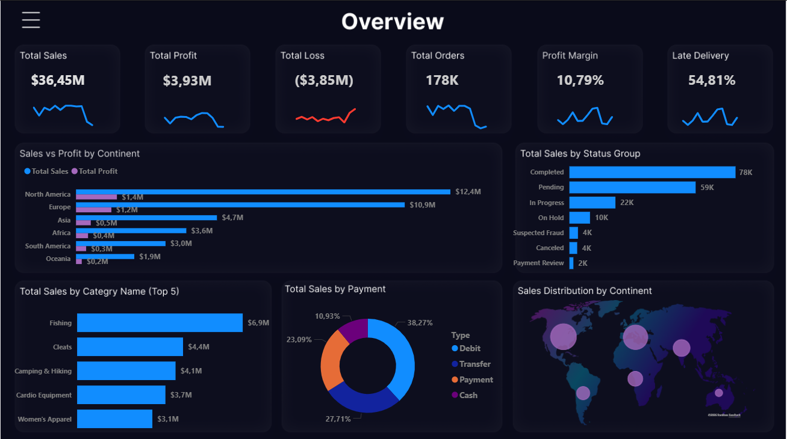
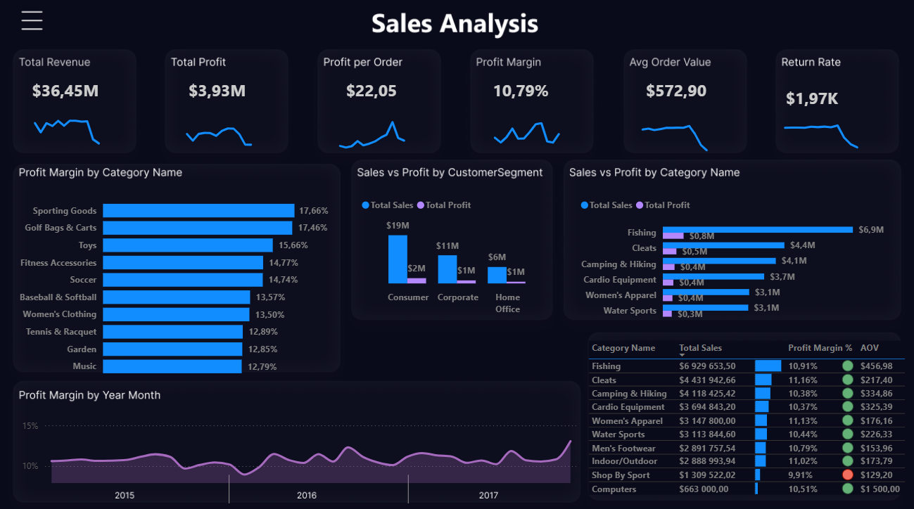
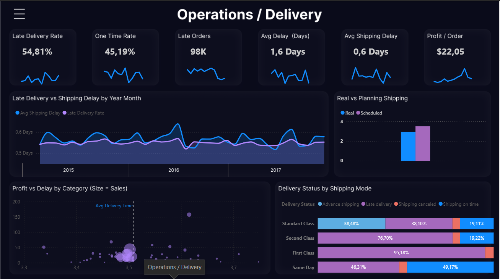
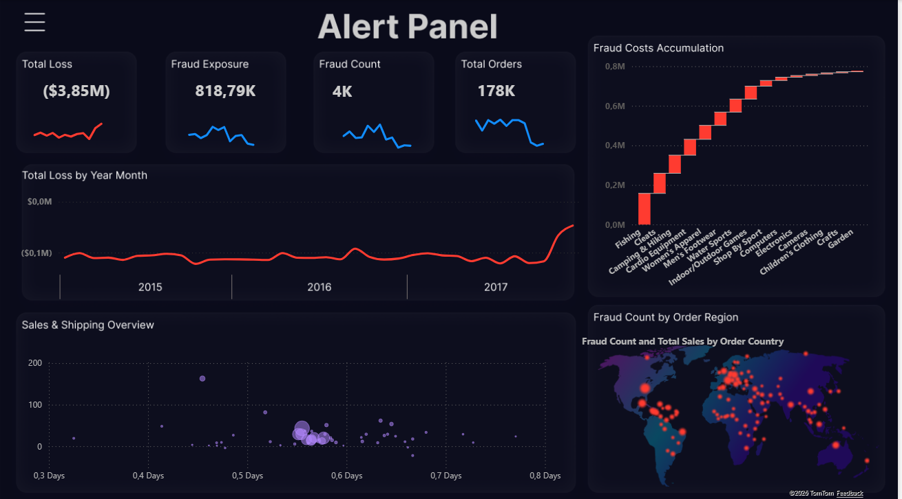

# Supply-Chain-Analytics-Dashboard
End-to-end Power BI project transforming raw supply chain data into an interactive dashboard for analyzing revenue, logistics performance, and operational risks.

# 📊 Supply Chain Analytics Dashboard

## 🔗 Live Demo
👉 [View Interactive Dashboard](https://app.powerbi.com/view?r=eyJrIjoiZTNjZGU3YTktNjRkNS00NGVlLWFiMDItNzg2MDY1N2YwYjVmIiwidCI6IjNkZmU5YWI2LTgxYmYtNDkxYy1iNjcwLTAxYzgyNGEwOWUxOSJ9)

---

## 📌 Project Overview
This project presents an end-to-end analysis of a global supply chain dataset using Power BI.

The objective was to transform raw transactional data into a **business-ready analytical solution** supporting decision-making in:
- sales performance  
- logistics efficiency  
- risk & fraud monitoring  

---

## 🎯 Business Objective
The dashboard helps to:
- monitor revenue and profitability  
- analyze delivery performance (on-time vs late)  
- identify operational bottlenecks  
- track fraud-related losses  

**Target users:**
- Supply Chain Managers  
- Operations Teams  
- Sales & Finance Analysts  

---

## 📊 Dashboard Preview

### 🔹 Overview


**Highlights:**
- $36.45M total sales and $3.93M profit  
- High late delivery rate (~55%)  
- Strong sales concentration in North America and Europe  

---

### 🔹 Sales Analysis


**Highlights:**
- Top-performing categories: Fishing, Cleats  
- Profit margin varies significantly across product groups  
- Consumer segment generates the highest revenue  

---

### 🔹 Operations / Delivery


**Highlights:**
- 54.81% late deliveries indicate operational inefficiency  
- Average delay: ~1.6 days  
- Clear relationship between delivery delays and reduced profit per order  

---

### 🔹 Alert Panel (Fraud & Loss)


**Highlights:**
- Total loss: $3.85M  
- Fraud exposure: ~818K  
- Fraud activity concentrated in specific regions  

---

## 🧱 Data Model
Implemented **Star Schema**:

- **Fact_Orders** – transactional data (sales, profit, logistics metrics)  
- **Dim_Products** – product hierarchy  
- **Dim_Customers** – customer data  
- **Dim_Geography** – standardized locations  
- **Dim_Date** – calendar table  

✔ optimized for performance  
✔ scalable and clean structure  

---

## 🔄 Data Preparation (Power Query)

### Data Cleaning
- removed redundant and technical columns  
- removed sensitive data (GDPR compliance)  
- eliminated unnecessary attributes  

### Standardization
- unified column names  
- corrected inconsistent country naming  
- cleaned text fields (Trim, formatting)  

### Date Handling
- removed time component  
- fixed US date format using locale  

### Data Types Optimization
- Currency → Fixed Decimal  
- Whole Numbers → performance optimization  
- Decimal → ratios  

### Geography Mapping
- standardized 160+ country names  
- created mapping table  
- ensured correct map visualization  

---

## ⚙️ Feature Engineering
Created new analytical columns:
- **Shipping Delay**  
- **Is Late (0/1)**  
- **Shipping Time**  

---

## 🧠 DAX Measures

```DAX
Total Sales = SUM(Fact_Orders[Sales])

Order Count = DISTINCTCOUNT(Fact_Orders[Order Id])

Late Deliveries = 
CALCULATE([Order Count], Fact_Orders[Is Late] = 1)

Late Delivery Rate = 
DIVIDE([Late Deliveries], [Order Count], 0)

On-Time Delivery % =
DIVIDE(
    CALCULATE([Order Count], Fact_Orders[Is Late] = 0),
    [Order Count]
)

## 🧠 Best Practices Applied

- Measure branching  
- Safe division using `DIVIDE()`  
- Context manipulation with `CALCULATE()`  

## 💡 Key Insights
- 🚨 High late delivery rate (~55%) signals major operational inefficiencies  
- 📉 Delivery delays directly impact profitability  
- 🌍 Revenue concentrated in North America and Europe  
- 🛍️ Top categories drive majority of sales  
- ⚠️ Fraud significantly contributes to total losses  

## 🎨 UX & Design
- Custom layout designed in Figma  
- Dark Mode (Cyberpunk style)  
- KPI cards with neon accents  
- Interactive drill-down (Continent → Country)  
- Advanced tooltips and filtering  

## 🚀 Technical Highlights
- Star Schema modeling  
- Staging query pattern  
- Centralized measures table  
- Time intelligence (Date table)  
- Optimized model performance  

## 📌 Conclusion
This project demonstrates:
- end-to-end BI workflow (ETL → modeling → visualization)  
- strong business-oriented analysis  
- ability to turn raw data into actionable insights  

## 📁 Dataset
DataCo Supply Chain Dataset (Kaggle)

## 📂 Additional Data
- `data/country_mapping.csv` – custom mapping table used to standardize country names and assign continents
